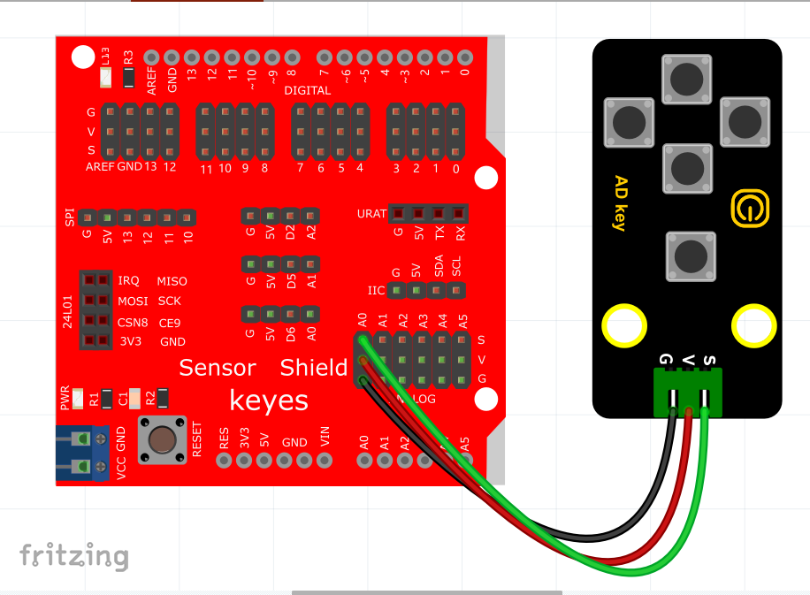
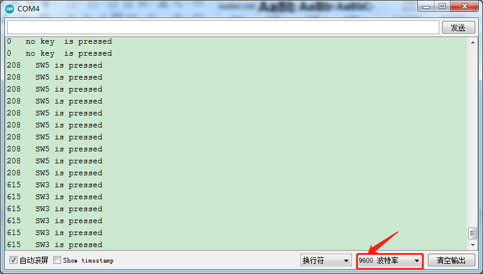

# Arduino


## 1. Arduino简介  

Arduino是一个开源电子原型平台，旨在为设计师、艺术家、学生和爱好者提供一个简单而灵活的方式来创建互动项目。基于微控制器的Arduino开发板允许用户使用C/C++语言编写代码，并通过Arduino IDE进行开发。Arduino的设计初衷是让编程与电子原件的结合变得容易，支持从初学者到专业人士的广泛应用。  

Arduino平台包括多种型号的控制板、传感器和模块，可实现丰富的功能，如灯光控制、传感器数据采集、机器人控制等。通过强大的开发工具和活跃的社区支持，用户可以分享其项目和创意，进一步推动Arduino的发展与应用。  

## 2. 接线图  

  

## 3. 测试代码  

```cpp  
int val = 0;  

int ADkey = A2; // 定义五路AD按键接模拟口A2  

void setup() {  
    Serial.begin(9600); // 设置波特率为9600  
}  

void loop() {  
    val = analogRead(ADkey); // 读取AD按键的模拟值并赋给变量val  
    Serial.print(val); // 打印变量val，根据条件判断哪个按键被按下  
    if (val <= 100) { // 没有按键按下  
        Serial.println(" no key is pressed");  
    } else if (val <= 300) { // 按键5按下  
        Serial.println(" SW5 is pressed");  
    } else if (val <= 500) { // 按键4按下  
        Serial.println(" SW4 is pressed");  
    } else if (val <= 700) { // 按键3按下  
        Serial.println(" SW3 is pressed");  
    } else if (val <= 900) { // 按键2按下  
        Serial.println(" SW2 is pressed");  
    } else { // 按键1按下  
        Serial.println(" SW1 is pressed");  
    }  
}  
```  

## 4. 代码说明  

在代码中，我们定义了一个整型变量`val`用于存储读取到的模拟值，通过`analogRead(ADkey)`函数将传感器的模拟值赋值给`val`。串口监视器显示当前的模拟值，并根据值的范围判断具体哪个按键被按下：  
- 当模拟值低于100时，表示没有按键被按下。  
- 当值在100到300之间时，表示按键SW5被按下。  
- 当值在300到500之间时，表示按键SW4被按下。  
- 当值在500到700之间时，表示按键SW3被按下。  
- 当值在700到900之间时，表示按键SW2被按下。  
- 当值大于900时，表示按键SW1被按下。  

这种通过区间判断公式以减小误差的方式，确保在实际使用中能够准确判断各按键的状态。  

## 5. 测试结果  

上传测试代码至Arduino成功，上电后，打开串口监视器并设置波特率为9600。当我们按下不同的按键时，串口监视器会打印出相应的信息，如下图所示。  




