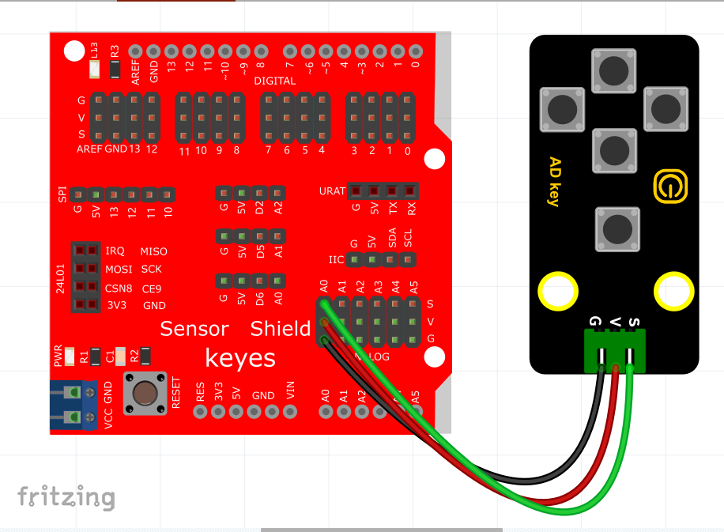

# KidsBlock

## 1. Kidsblock简介  

Kidsblock是一款专为儿童和初学者设计的可视化编程工具，旨在通过简单的图形化界面帮助用户轻松学习编程与电子技术。它采用拖放式编程的方式，让用户无需深入了解复杂的编程语法就能创建自己的项目，适合多种硬件平台，例如Arduino、Micro:bit等。   

Kidsblock通过丰富的传感器和模块支持，提供了多种功能，可以实现机器人控制、传感器应用、游戏开发等。这个平台注重互动性和实践性，鼓励孩子们在实验中探索和创造，培养他们的逻辑思维和解决问题的能力。同时，Kidsblock还提供了大量的示例和教程，帮助用户轻松掌握编程技能。  

## 2. 接线图  

  

## 3. 测试代码  

  

## 4. 代码说明  

### 4.1 创建变量  

在实验中，首先创建一个整数变量，命名为`item`。  

  

### 4.2 设置波特率  

由于需要在串口监视器上显示信息，因此需要设置波特率。  

  

### 4.3 读取模拟值  

将读取的模拟值赋值给变量`item`，并通过串口监视器显示该值。  

  

### 4.4 判断按键状态  

对读取到的模拟值进行判断：  
- 当模拟值低于100时，表示没有按键被按下；  
- 当值在100到300之间时，表示按键SW5被按下；  
- 当值在300到500之间时，表示按键SW4被按下；  
- 当值在500到700之间时，表示按键SW3被按下；  
- 当值在700到900之间时，表示按键SW2被按下；  
- 当值大于900时，则表示按键SW1被按下。  

使用这种区间判断方式，可以减少误差，确保准确识别按键状态。  

  

## 5. 测试结果  

上传测试代码成功，上电后打开串口监视器。当我们按下不同的按键时，串口监视器将打印出相应的信息，如下图所示。  

