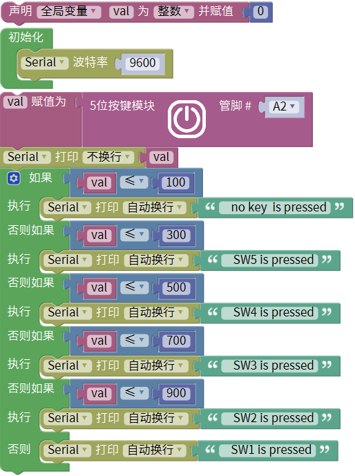
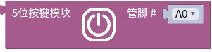
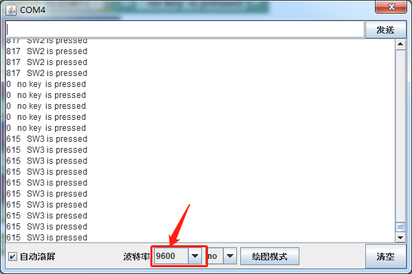

# Mixly

## 1. Mixly简介  

Mixly是一款用户友好的可视化编程工具，专为初学者和教育者设计，旨在通过直观的图形化界面简化编程学习。Mixly支持多种平台，包括Arduino和Micro:bit等，允许用户通过拖拽的方式创建程序，而无需深入了解复杂的代码语法。这种易于使用的特性使得Mixly成为学生、教师及爱好者在编程和电子项目中的理想选择。  

Mixly集成了丰富的传感器和模块，同时提供多个项目示例，帮助用户通过实践加深理解。该平台鼓励创意和探索，用户可以通过完成各类互动项目，培养编程能力和逻辑思维。Mixly不仅支持C语言，也与Scratch编程语言兼容，进一步优化了学习体验。  

## 2. 接线图  

  

## 3. 测试代码  

  

## 4. 代码说明  

### 4.1 导入库和创建变量  

在实验中，首先需要导入`keyes sensor`库，并创建一个整数变量`val`。  

  

### 4.2 设置连接  

在导入的库`keyes sensor`下找到“其他模块”单元，选择5位按键模块。我们需要将其连接到模拟口A2。  

  

### 4.3 读取模拟值  

读取的模拟值赋给变量`val`，并通过串口监视器显示此值，默认波特率设置为9600（可更改）。  

### 4.4 判断按键状态  

对读取到的模拟值进行判断：  
- 当值低于100时，按键未被按下；  
- 值在100到300之间时，按键SW5被按下；  
- 值在300到500之间时，按键SW4被按下；  
- 值在500到700之间时，按键SW3被按下；  
- 值在700到900之间时，按键SW2被按下；  
- 值在900以上时，按键SW1被按下。  

使用区间判断能够减小误差，确保准确识别每个按键的状态。  

## 5. 测试结果  

上传测试代码成功，上电并打开串口监视器。当按下不同的按键时，串口监视器将打印出相应的信息，如下图所示。  

