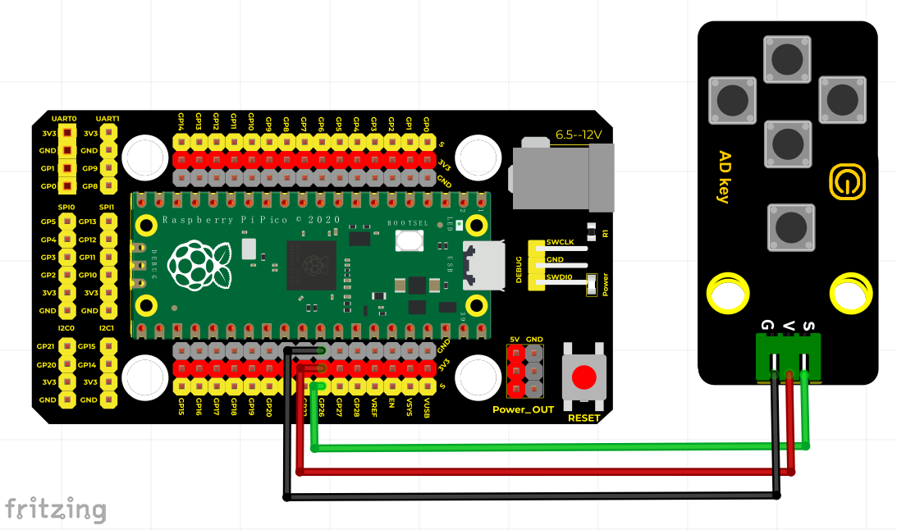
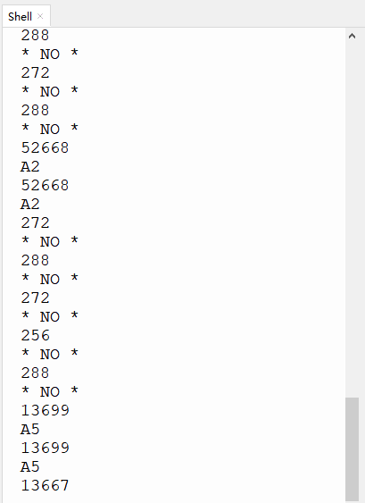

# Python


## 1. Python简介  

Python是一种广泛使用的高级编程语言，以其简洁易读的语法而闻名，适合初学者与专业开发者使用。它是多程序设计范式语言，不仅支持面向对象编程，也支持过程式和函数式编程。Python的应用场景非常广泛，从Web开发、数据分析、人工智能到自动化脚本等领域，几乎无所不包。  

Python拥有丰富的标准库和众多第三方包，使得开发者能够快速构建功能强大的应用程序。其活跃的社区和大量在线资源，使得学习和使用Python变得更加便捷。Python的跨平台特性使得程序可以在Windows、macOS和Linux等不同操作系统间运行。  

## 2. 接线图  

  

## 3. 测试代码  

```python  
import utime  

potentiometer = machine.ADC(26)  # 将GP26作为模拟信号采集引脚  

voltage = 0  

while True:  
    voltage = potentiometer.read_u16()  
    print(voltage)  # 打印模拟值  
    utime.sleep(0.1)  

    # 按键没按下时打印NO  
    if 0 < voltage < 400:  
        print('* NO *')  

    # 按键1按下时打印A1  
    if 53000 < voltage < 65536:  
        print('A1')  

    # 按键2按下时打印A2  
    if 40000 < voltage < 53000:  
        print('A2')  

    # 按键3按下时打印A3  
    if 27000 < voltage < 40000:  
        print('A3')  

    # 按键4按下时打印A4  
    if 14000 < voltage < 27000:  
        print('A4')  

    # 按键5按下时打印A5  
    if 500 < voltage < 14000:  
        print('A5')  
```  

## 4. 代码说明  

在这段代码中，我们将读取的模拟值赋给变量`voltage`，并使用`print`函数在控制台显示它的值。我们对读取到的模拟值进行了判断，以确定哪些按键被按下：  

- 当模拟值低于400时，表示没有按键按下。  
- 当值在53000到65536之间时，表示按键1被按下。  
- 当值在40000到53000之间，表示按键2被按下。  
- 当值在27000到40000之间，表示按键3被按下。  
- 当值在14000到27000之间，表示按键4被按下。  
- 当值处于500到14000之间，表示按键5被按下。  

此方法通过定义数值区间来避免因固定值带来的误差，确保按键状态的准确识别。  

## 5. 测试结果  

上传测试代码成功后，接通电源并打开串口监视器，设置波特率为9600。当我们按下不同的按键时，串口监视器将打印出对应的信息，如下图所示。  




